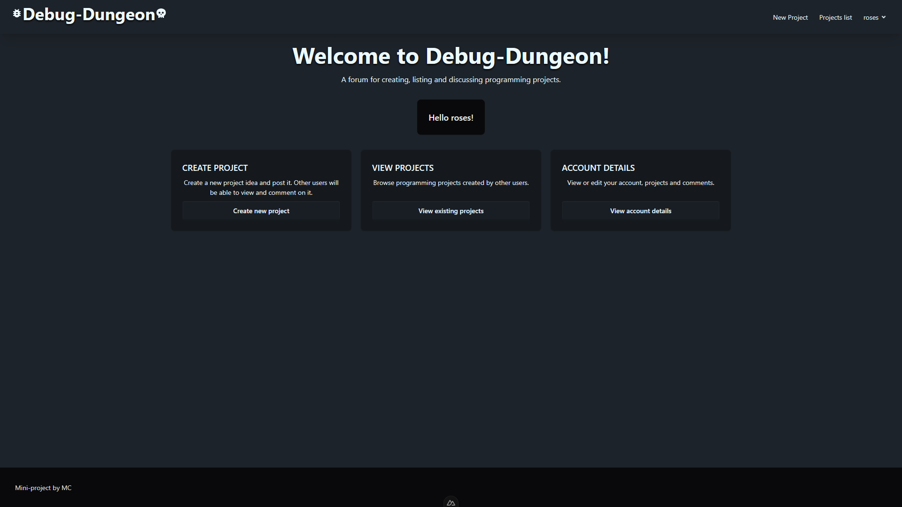
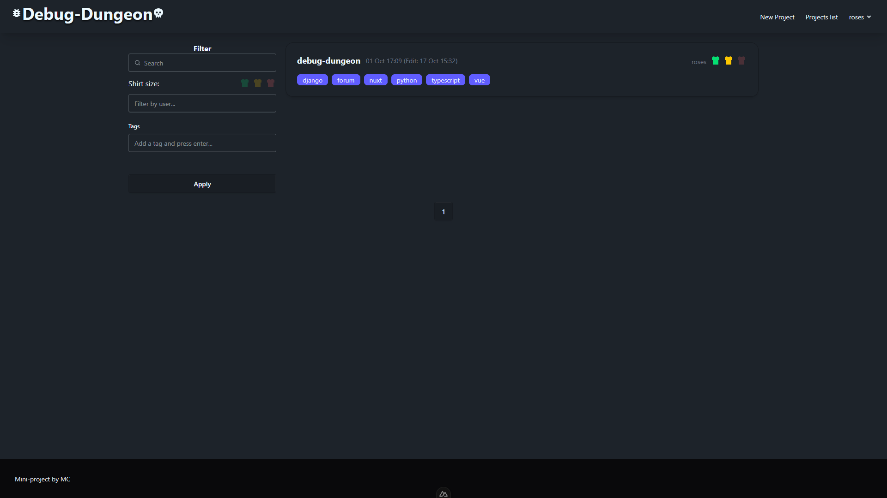

# Debug Dungeon

The frontend of a project for listing, creating and commenting on educational programming mini-projects.
## Screenshots
Home page

List of projects


## Setup
Make sure to install dependencies:
```bash
# npm
npm install
# pnpm
pnpm install
# yarn
yarn install
# bun
bun install
```
## Development Server
Start the development server on `http://localhost:3000`:
```bash
# npm
npm run dev
# pnpm
pnpm dev
# yarn
yarn dev
# bun
bun run dev
```
## Production
Build the application for production:
```bash
# npm
npm run build
# pnpm
pnpm build
# yarn
yarn build
# bun
bun run build
```
Locally preview production build:
```bash
# npm
npm run preview
# pnpm
pnpm preview
# yarn
yarn preview
# bun
bun run preview
```